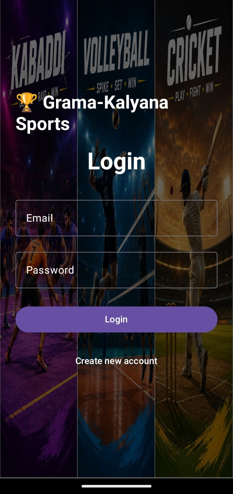
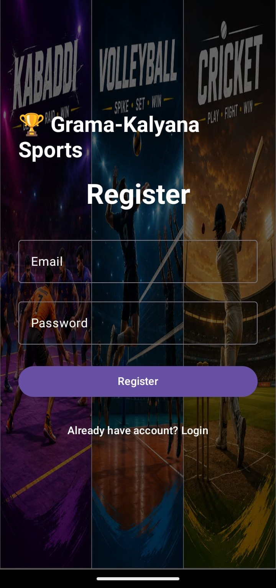
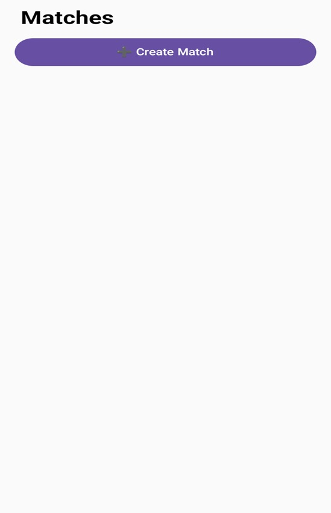
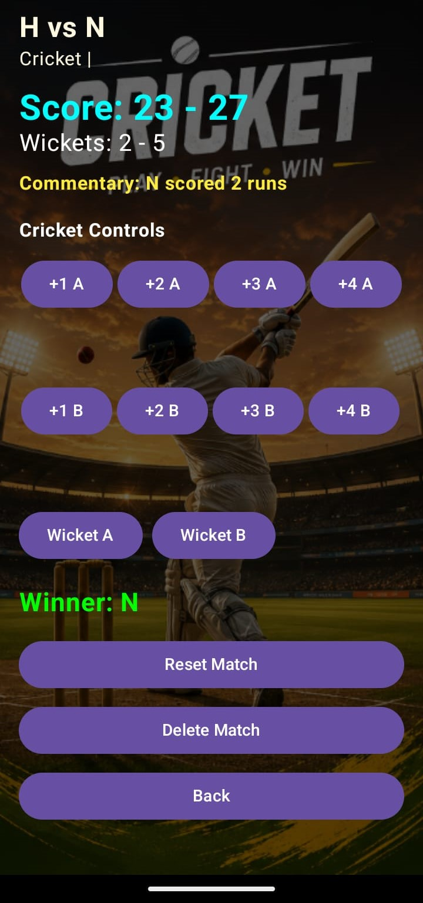
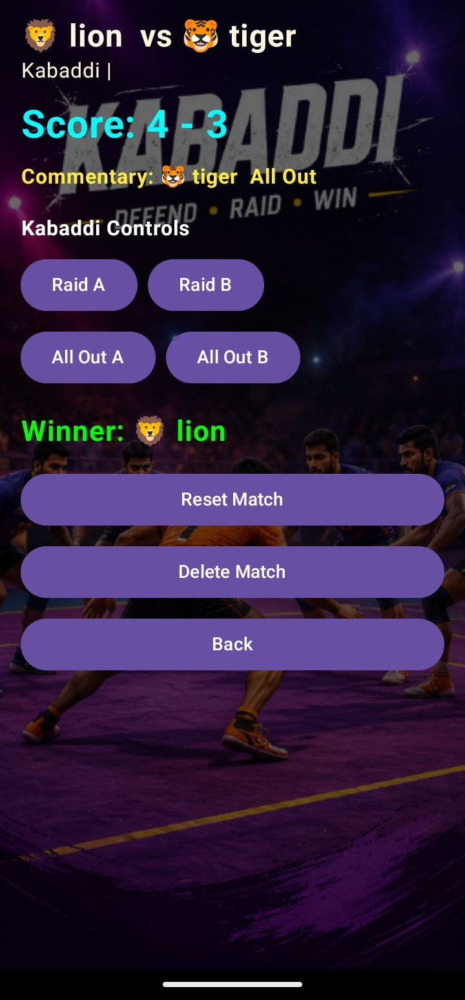
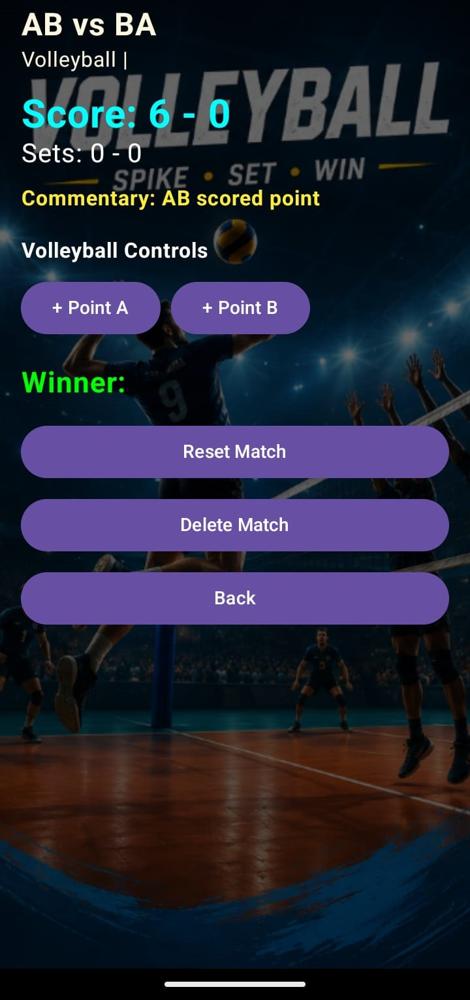

# 🏆 Grama-Kalyana Sports

A professional Android sports management application for creating, managing, and tracking live village sports tournaments.

---

## 📱 Overview

Grama-Kalyana Sports is an Android application built to digitize village-level sports event management. The app allows organizers to create matches, manage teams, track live scores, and monitor match progress in real time.

### Supported Sports
- 🏏 Cricket
- 🤼 Kabaddi
- 🏐 Volleyball

---

## ✨ Features

### 🔐 Authentication
- User Registration
- Secure Login
- Firebase Authentication Integration

### 🏟 Match Management
- Create New Matches
- Add Team Names
- Add Team Leaders
- Add Players
- Select Venue
- Select Match Date & Time
- Sport Selection

### 📊 Live Score Tracking

#### 🏏 Cricket
- Run Scoring (+1, +2, +3, +4, +6)
- Wicket Tracking
- Winner Detection
- Live Commentary

#### 🤼 Kabaddi
- Raid Points
- All-Out Scoring
- Live Commentary
- Winner Tracking

#### 🏐 Volleyball
- Point Scoring
- Set Tracking
- Automatic Winner Detection

### ⚙ Additional Features
- Match Reset
- Delete Match
- Firebase Realtime Database Sync
- Sports-Themed UI
- Dynamic Background Images by Sport

---

## 🛠 Tech Stack
- Kotlin
- Jetpack Compose
- Firebase Authentication
- Firebase Realtime Database
- Material 3
- Android Studio

---

## 📂 Project Structure

```bash
app/
 ┣ manifests/
 ┣ kotlin+java/
 ┃ ┗ com.example.gramakalyanasports
 ┃    ┣ LoginActivity.kt
 ┃    ┣ RegisterActivity.kt
 ┃    ┣ MainActivity.kt
 ┃    ┣ Match.kt
 ┃    ┣ MatchRepository.kt
 ┃    ┣ ViewerScreen.kt
 ┃    ┣ HistoryScreen.kt
 ┃    ┣ LeaderboardScreen.kt
 ┃    ┗ NotificationHelper.kt
```

---

## 🚀 Installation

### Clone Repository
```bash
git clone https://github.com/Narayana-04/Grama-Kalyana-Sports.git
```

### Setup
1. Open project in Android Studio
2. Add Firebase config file:

```text
app/google-services.json
```

3. Sync Gradle
4. Run the project

---

## 📸 App Screenshots

### Authentication

| Login Screen | Register Screen |
|-------------|----------------|
|  |  |

---

### Match Creation



---

### Live Scoring

| Cricket | Kabaddi | Volleyball |
|---------|---------|------------|
|  |  |  |

---

## 🔮 Future Improvements
- Tournament Brackets
- Push Notifications
- Player Profiles
- Team Statistics
- Match Reports PDF
- Advanced Admin Dashboard

---

## 👨‍💻 Developer

**K Sharath Narayana**

Android Developer | Kotlin | Jetpack Compose | Firebase
